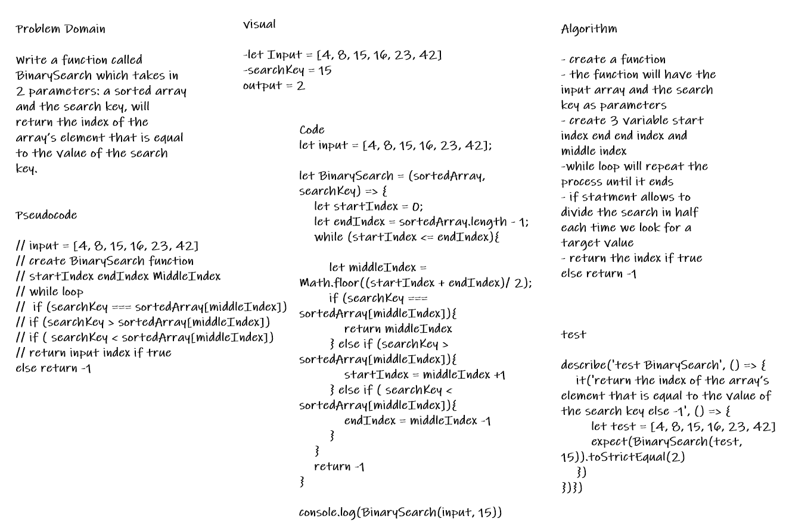

# Binary Search of Sorted Array

* Write a function called BinarySearch which takes in 2 parameters: a sorted array and the search key, will return the index of the array’s element that is equal to the value of the search key.

## Whiteboard Process

## Approach & Efficiency

* for loop over the input to check

* if statment will check if the search key equal to the value in the array
