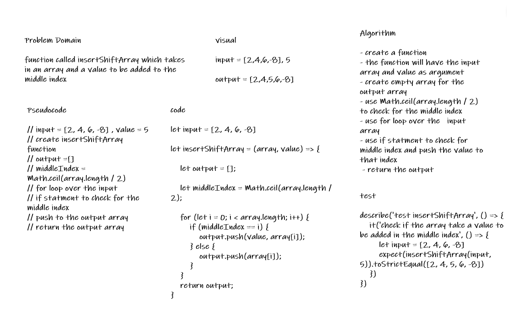

# Insert to Middle of an Array

* function called insertShiftArray which takes in an array and a value to be added to the middle index

## Whiteboard Process

## Approach & Efficiency

* use Math.ceil(array.length / 2) to check for the middle index

* to check using the if inside the for to the middle index then push the value in the index
