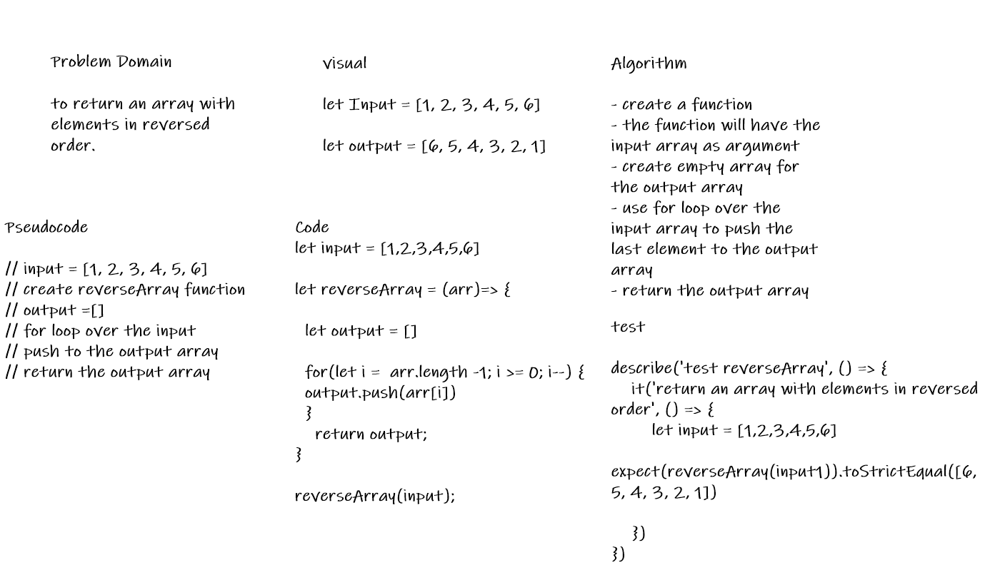

# Reverse an Array

* return an array with elements in reversed order.  

## Whiteboard Process

## Approach & Efficiency

* for loop over the input

* push to the output array

* return the output array
