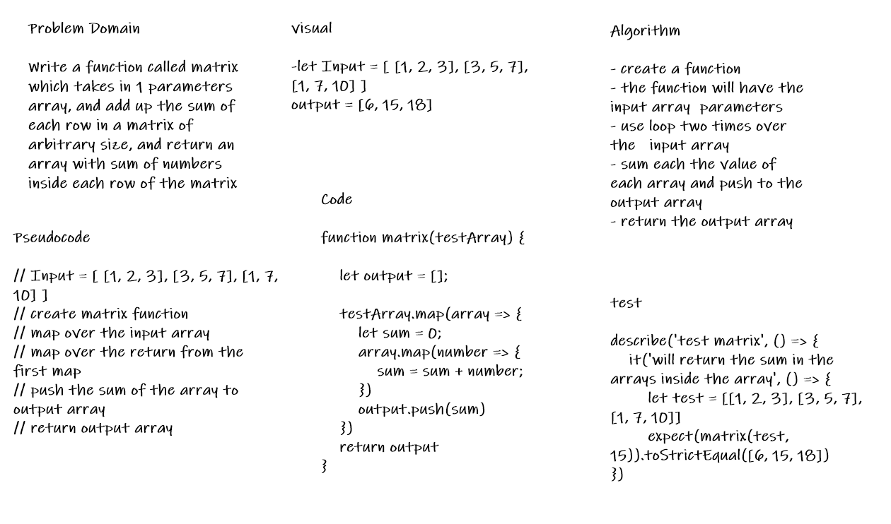

# Binary Search of Sorted Array

* Write a function called matrix which takes in 1 parameters array, and add up the sum of each row in a matrix of arbitrary size, and return an array with sum of numbers inside each row of the matrix

## Whiteboard Process

## Approach & Efficiency

* two loops over the input array sum the arrays inside the array and return the output array
