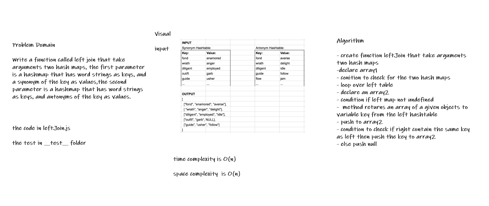

# Hashmap LEFT JOIN

* The SQL LEFT JOIN returns all rows from the left table, even if there are no matches in the right table. This means that if the ON clause matches 0 (zero) records in the right table; the join will still return a row in the result, but with NULL in each column from the right table.

## Challenge

* Write a function called left join that take arguments two hash maps, the first parameter is a hashmap that has word strings as keys, and a synonym of the key as values,the second parameter is a hashmap that has word strings as keys, and antonyms of the key as values.

## Whiteboard Process

## Approach & Efficiency

* create function leftJoin that take arguments two hash maps
* conition to check for the two hash maps
* loop over left table
* condition if left map not undefined
* method returns an array of a given objects to variable key from the left hashtable
* condition to check if right contain the same key as left

## Solution

* [the code](./leftJoin.js)

* to run the test npm test

* [the test](./__test__/leftJoin.test.js)
