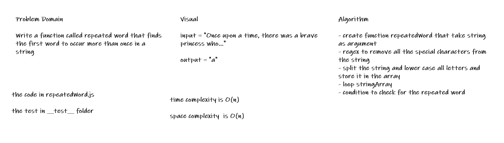

# Challenge Summary

* Write a function called repeated word that finds the first word to occur more than once in a string

## Whiteboard Process

## Approach & Efficiency

* create function repeatedWord that take string as argument
* regex to remove all the special characters from the string
* split the string and lower case all letters and store it in the array
* loop stringArray
* condition to check for the repeated word

## Solution

* [the code](./repeatedWord.js)

* to run the test npm test

* [the test](./__test__/repeatedWord.test.js)
