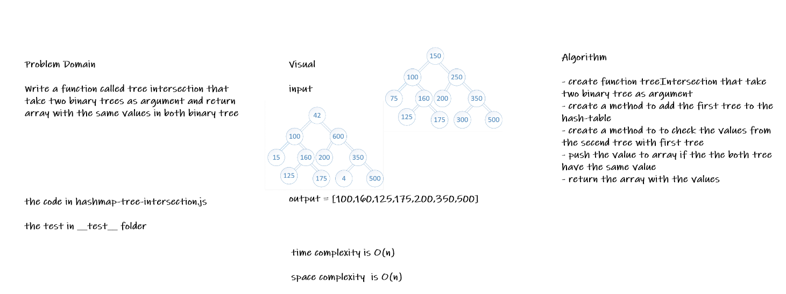

# Challenge Summary

* Write a function called tree intersection that take two binary trees as argument and return array with the same values in both binary tree

## Whiteboard Process

## Approach & Efficiency

* create function treeIntersection that take two binary tree as argument
* create a method to add the first tree to the hash*table
* create a method to to check the values from the secend tree with first tree
* push the value to array if the the both tree have the same value
* return the array with the values

## Solution

* [the code](./treeIntersection.js)

* to run the test npm test

* [the test](./__test__/treeIntersection.test.js)
