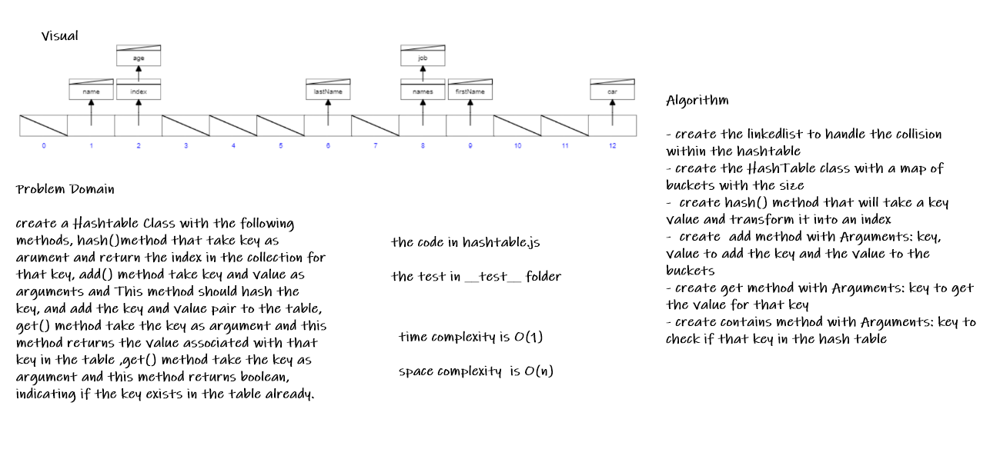

# Hashtables

* is a data structure that implements an associative array abstract data type, a structure that can map keys to values. A hash table uses a hash function to compute an index, also called a hash code, into an array of buckets or slots, from which the desired value can be found. During lookup, the key is hashed and the resulting hash indicates where the corresponding value is stored.

## Challenge

* create a Hashtable Class with the following methods, hash()method that take key as arument and return the index in the collection for that key, add() method take key and value as arguments and This method should hash the key, and add the key and value pair to the table, get() method take the key as argument and this method returns the value associated with that key in the table ,get() method take the key as argument and this method returns boolean, indicating if the key exists in the table already.

## Whiteboard Process

* 

## Approach & Efficiency

* i create the linkedlist to handle the collision within the hashtable

* then create the HashTable class with a map of buckets with the size

* then  hash() method that will take a key value and transform it into an index

* then create  add method with Arguments: key, value to add the key and the value to the buckets

* then get method with Arguments: key to get the value for that key

* then contains method with Arguments: key to check if that key in the hash table

## API

* **add()**: add the key and value pair to the hash table, and will handling collisions

* **get()**: check if the key is in hash table and will get the value associated with that key in the hash table

* **contains**: to check if that key in the hash table
