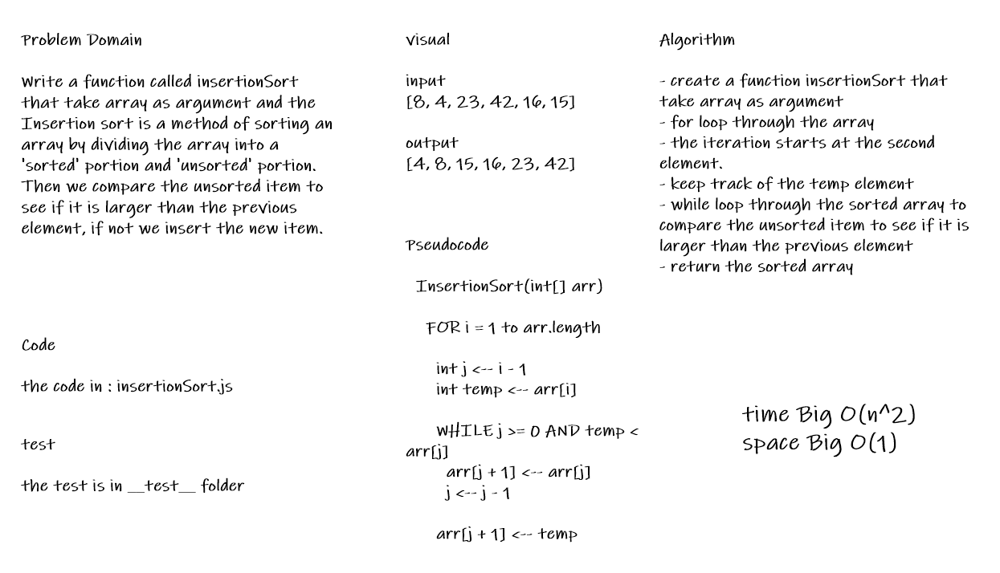
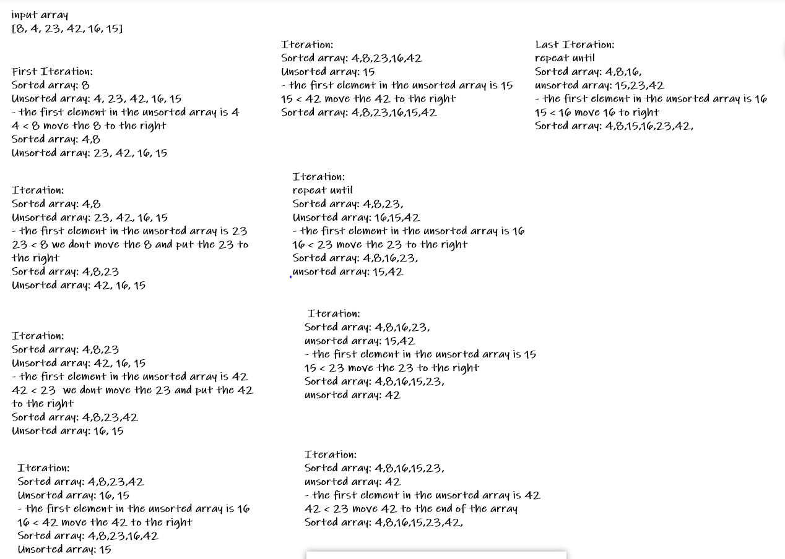

# Challenge Summary

* Insertion sort is a method of sorting an array by dividing the array into a 'sorted' portion and 'unsorted' portion. Then we compare the unsorted item to see if it is larger than the previous element, if not we insert the new item.

## Whiteboard Process

## Trace The Algorithm

## Approach & Efficiency

* i create a function insertionSort that take array as argument

* then for loop through the array

* then a while loop through the sorted array to compare the unsorted item to see if it is larger than the previous element

* then return the sorted array

## Solution

* [the code](./insertionSort.js)

* to run the test npm test

* [the test](./__test__/insertionSort.test.js)
