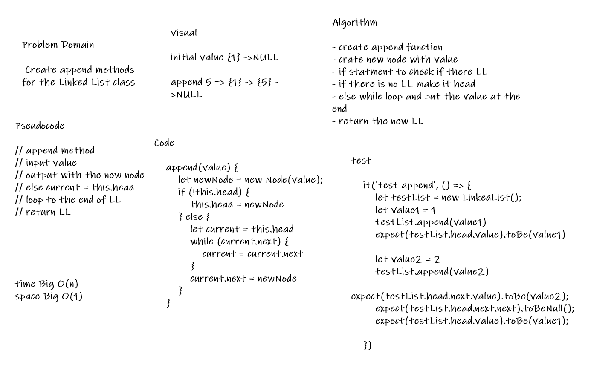
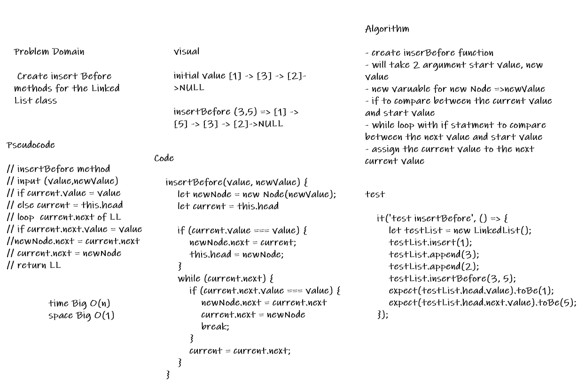
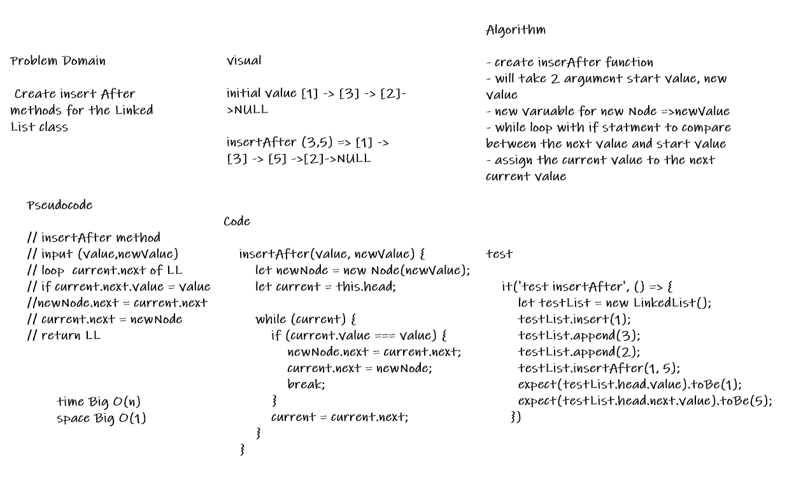

# linked-list-insertions

* Create the following methods for the Linked List class append , insertBefore , insertAfter

## Whiteboard Process

## Approach & Efficiency

* Create a Node class
* Create a Linked List class that have insert,includes and to string
* Create methods append, insertBefore , insertAfter
