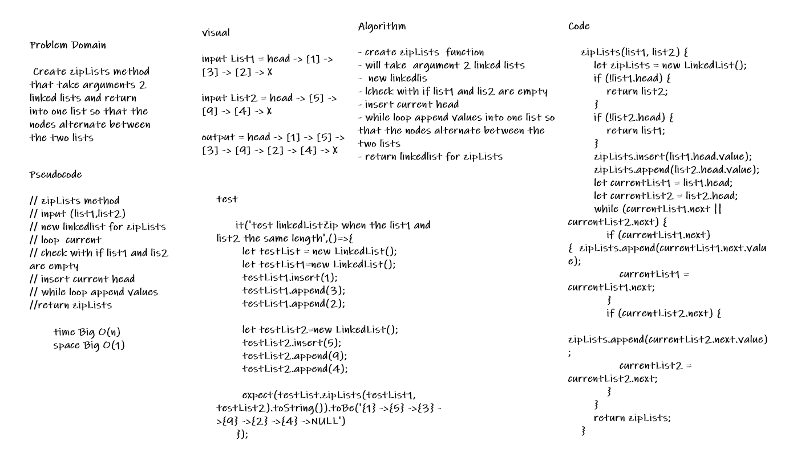

# linked-list-zip

* Create zipLists method that take arguments 2 linked lists and return into one list so that the nodes alternate between the two lists

## Whiteboard Process

## Approach & Efficiency

* Create a Node class
* Create a Linked List class that have insert,includes and to string
* Create methods append, insertBefore , insertAfter
* Create methods kth from end
* Create zipLists
