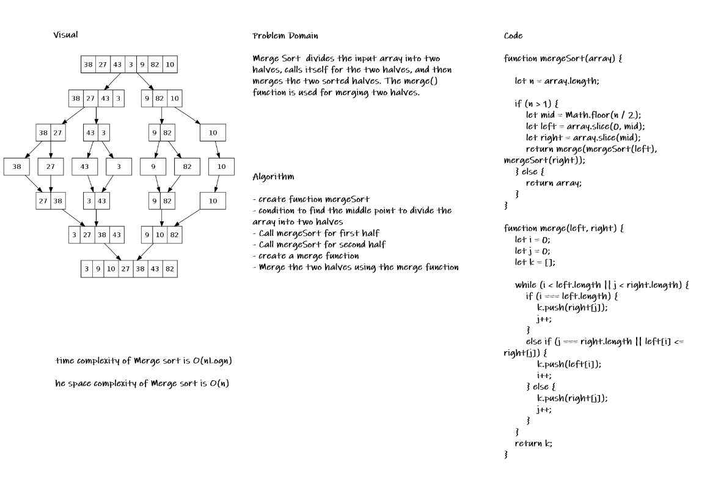
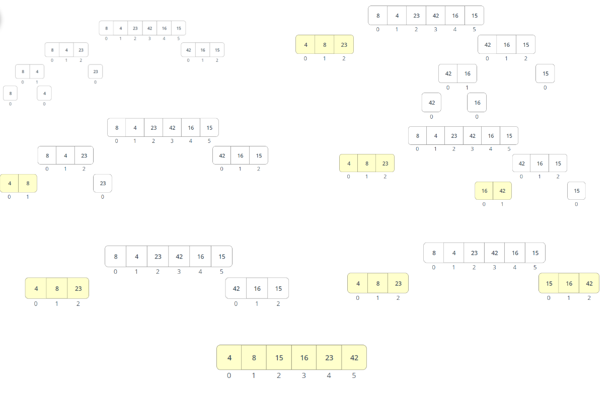

# Challenge Summary

* Merge sort is a sorting algorithm that uses the “divide and conquer” concept, and its a sorting technique that yake a list and repeatedly divided into two until all the elements are separated individually. Pairs of elements are then compared, placed into order and combined.

## Whiteboard Process

* 

## Trace The Algorithm

* 

## Approach & Efficiency

* create function mergeSort
* condition to find the middle point to divide the array into two halves
* Call mergeSort for first half
* Call mergeSort for second half
* create a merge function
* Merge the two halves using the merge function

## Solution

* [the code](./mergeSort.js)

* to run the test npm test

* [the test](./__test__/mergeSort.test.js)
