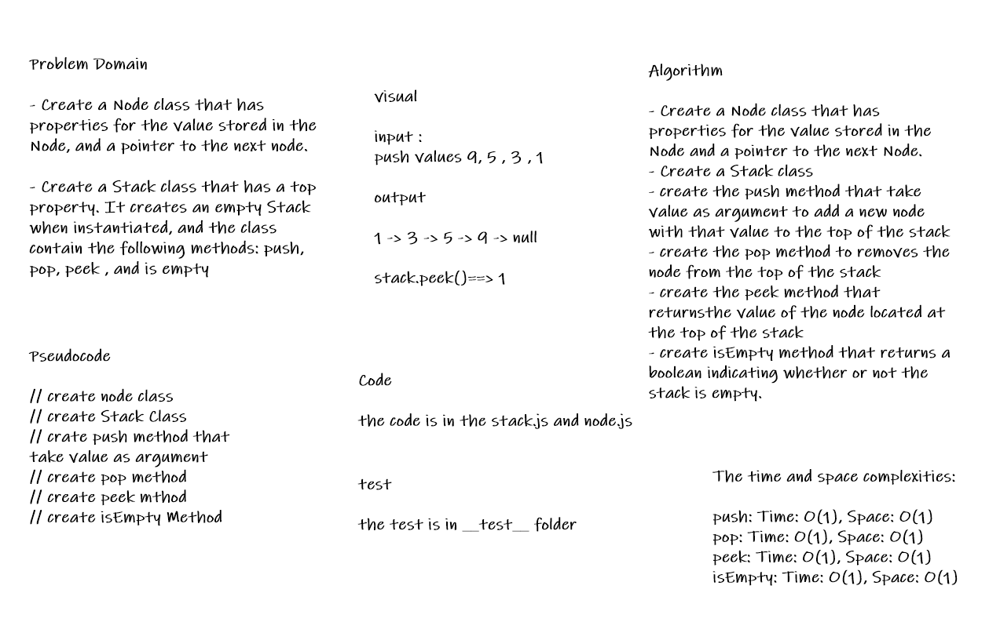
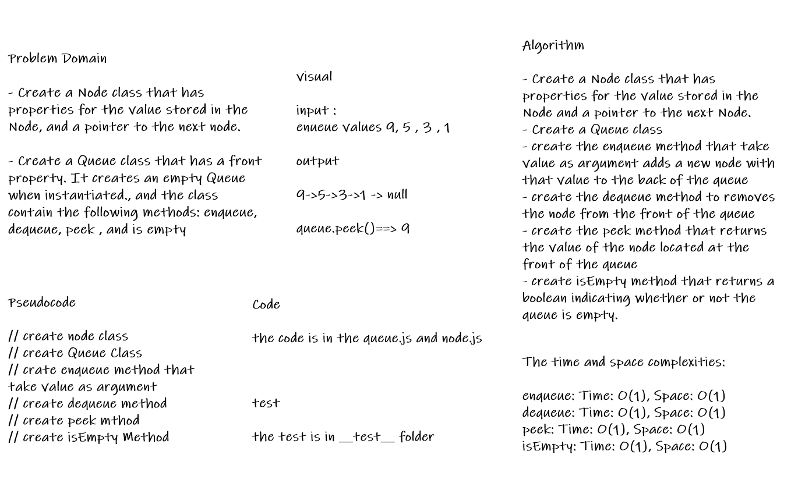

# Stacks and Queues

* Stack is a container of objects that are inserted and removed according to the last-in first-out (LIFO) principle. Queue is a container of objects (a linear collection) that are inserted and removed according to the first-in first-out (FIFO) principle.

## Challenge

* Create a Node class that has properties for the value stored in the Node, and a pointer to the next node.

* Create a Stack class that has a top property. It creates an empty Stack when instantiated

>
> The class should contain the following methods:
>
> push, pop , peek , is empty
>

* Create a Queue class that has a front property. It creates an empty Queue when instantiated.

>
> The class should contain the following methods:
>
> enqueue, dequeue , peek , is empty
>

## Whiteboard Process

* Stack

* Queue

## Approach & Efficiency

* i create the node class that hase properties for the value stored in the Node, and a pointer to the next node.

* then create a Stack class that creates an empty Stack when instantiated

* then create the methods inside the Stack class:
>
> push method that take value as argument and adds a new node with that value to the top of the stack with an O(1) Time performance.
>
> pop method that returns the value of the node located at the top of the stack and removes the node from the top of the stack and will return exception when called on empty stack
>
> peek method that returns the value of the node located at the top of the stack and return exception when called on empty stack
>
> is empty method that returns boolean to indicating whether or not the stack is empty.
>

* then i create a Queue class that has a front property. It creates an empty Queue when instantiated

* then create the methods inside the Queue class:
>
> enqueue method that take value as argument and adds a new node with that value to the back of the queue with an O(1) Time performance.
>
> dequeue method that returns the value from node from the front of the queue and removes the node from the front of the queue and will return exception when called on empty queue
>
> peek method that returns the value of the node located at the front of the queue and return exception when called on empty queue
>
> is empty method method that returns boolean to indicating whether or not the Queue is empty.
>

## API

* Stack:

>
> push(value): adds a new node with that value to the top of the stack with an O(1) Time performance.
>
> pop(): Returns: the value from node from the top of the stack
>
> peek(): Returns: Value of the node located at the top of the stack
>
> isEmpty(): Returns: Boolean indicating whether or not the stack is empty.

* Queue:

>
> enqueue(value): adds a new node with that value to the back of the queue with an O(1) Time performance.
>
> dequeue(): Returns: the value from node from the front of the queue
>
> peek(): Returns: Value of the node located at the front of the queue
>
> isEmpty(): Returns: Boolean indicating whether or not the queue is empty
