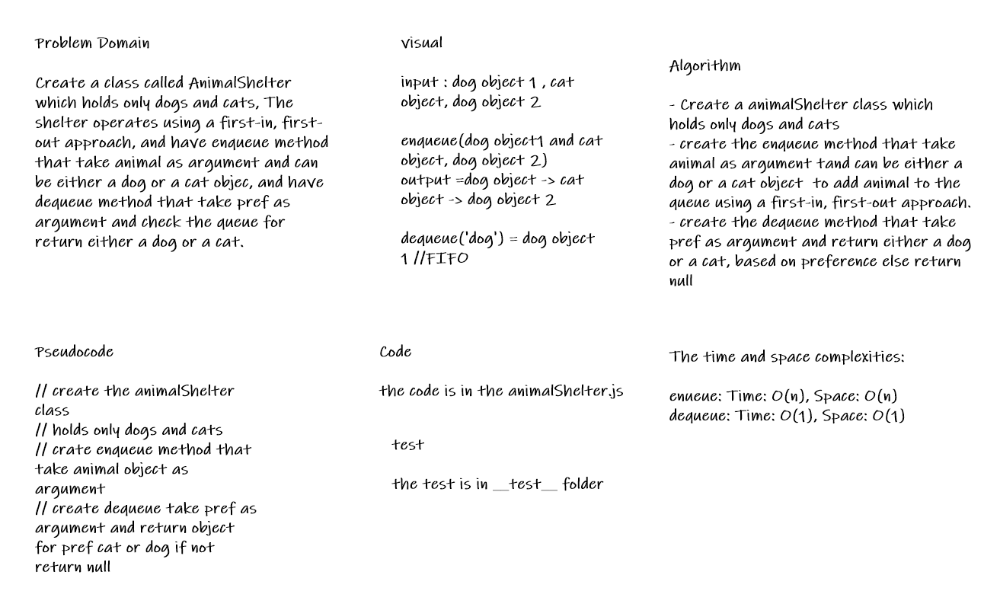

# Challenge Summary

Create a class called AnimalShelter which holds only dogs and cats, The shelter operates using a first-in, first-out approach, and have enqueue method that take animal as argument and can be either a dog or a cat objec, and have dequeue method that take pref as argument and check the queue for return either a dog or a cat.

## Whiteboard Process

## Approach & Efficiency

* the node class and the queue class is from last challenge

* i create the animalShelter class which holds only dogs and cats to handle the animal type dog or cat

* then create the enqueue that take animal as argument and can be either a dog or a cat object and use queue class to add animal to the queue using a first-in, first-out approach.

* then create the dequeue that that take pref as argument and check the queue for return either a dog or a cat, based on preferenceextract, if it not a dog or cat return null

## Solution

* to run the code :
>
> node code-challenges/stack-queue-animal-shelter/animalShelter.js
>

* [the code](./animalShelter.js)

* to run the test npm test

* [the test](./__test__/animalShelter.test.js)
