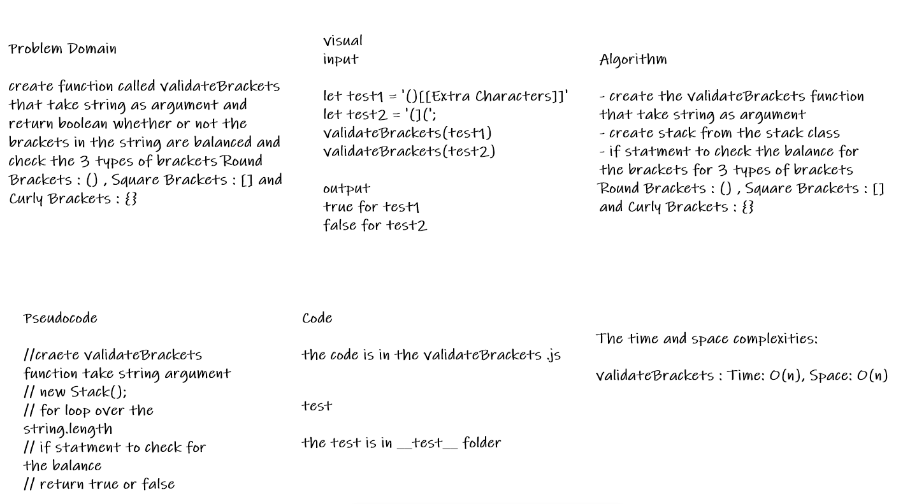

# Challenge Summary

* create function called validateBrackets that take string as argument and return boolean whether or not the brackets in the string are balanced and check the 3 types of brackets Round Brackets : () , Square Brackets : [] and Curly Brackets : {}

## Whiteboard Process

## Approach & Efficiency

* the node class and the stack class is from last challenge

* i create the validateBrackets function that take string as argument

* then create stack from the stack class

* then crate a for loop over the sring length

* inside the for loop create if statment to check the balance for the brackets and use push and peek and pop methods

* then check the stack isEmpty method in if statment

## Solution

* to run the code :
>
> node code-challenges/stack-queue-brackets/stack-queue-brackets.js
>

* [the code](./stack-queue-brackets.js)

* to run the test npm test

* [the test](./__test__/stack-queue-brackets.test.js)
