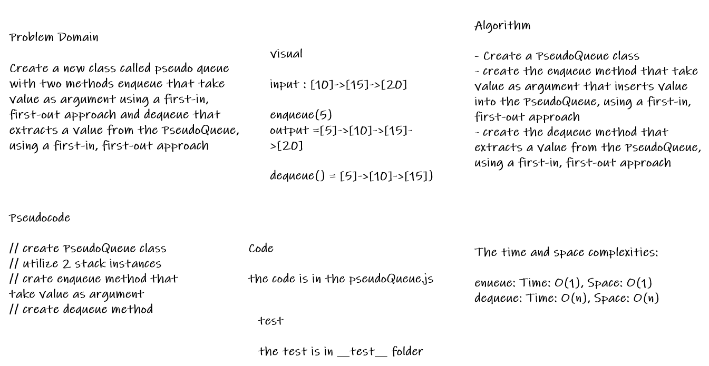

# Challenge Summary

* Create a new class called pseudo queue with two methods enqueue that take value as argument using a first-in, first-out approach and dequeue that extracts a value from the PseudoQueue, using a first-in, first-out approach

## Whiteboard Process

* 

## Approach & Efficiency

* the node class and the stack class is from last challenge

* i create the PseudoQueue and utilize 2 stack instances to create and manage the queue

* then create the enqueue that take value as argument and use stack.push to add value to the stack, using a first-in, first-out approach

* then create the dnqueue that extracts a value from the PseudoQueue using a first-in, first-out approach using the pop method from stack

## Solution

* to run the code :
>
> node code-challenges/stack-queue-pseudo/pseudoQueue.js
>

* [the code](./pseudoQueue.js)

* to run the test npm test

* [the test](./__test__/pseudoQueue.test.js)
