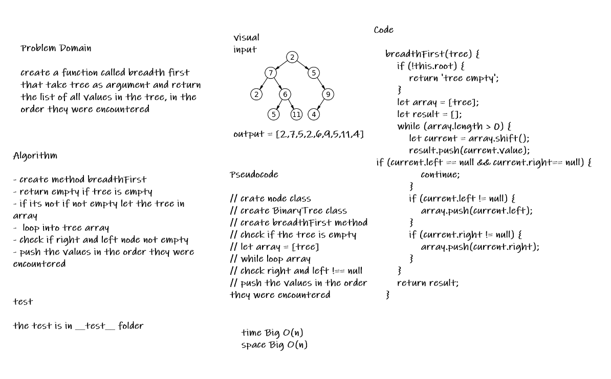

# Challenge Summary

* create a function called breadth first that take tree as argument and return the list of all values in the tree, in the order they were encountered

## Whiteboard Process

## Approach & Efficiency

* the node class and the BinaryTree class is from last challenge

* i create the breadthFirst function

* then check if if the tree is empty

* if not empty let the tree in array

* loop into tree array

* check if right and left node not empty

* push the values in the order they were encountered

## Solution

* [the code](./binaryTree.js)

* to run the test npm test

* [the test](./__test__/binaryTree.test.js)
