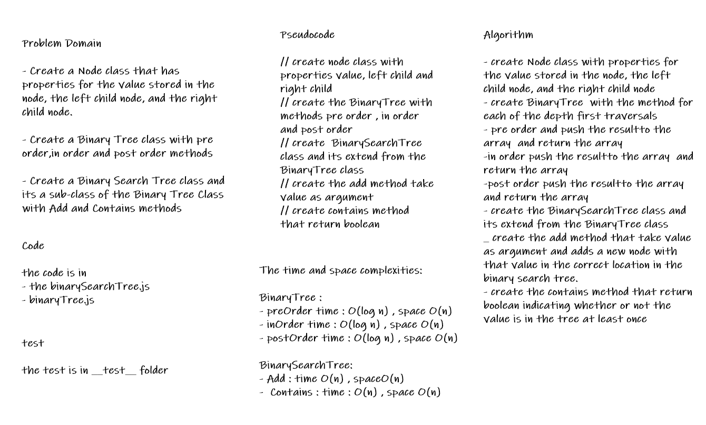

# Trees

A tree is a data structure where a node can have zero or more children. Each node contains a value. Like graphs, the connection between nodes is called edges.

## Challenge

* Create a Node class that has properties for the value stored in the node, the left child node, and the right child node.

* Create a Binary Tree class with pre order,in order and post order methods

* Create a Binary Search Tree class and its a sub-class of the Binary Tree Class with Add and Contains methods

## Whiteboard Process

## Approach & Efficiency

* i create the node class that has properties for the value stored in the node, the left child node, and the right child node.

* then create the BinaryTree class and has a method for each of the depth first traversals
>
> preOrder(): the output => `root >> left >> right` that performs inorder traversal of a tree starting from a given node
>
> inOrder():  the output => `left >> root >> right` that performs preorder traversal of a tree starting from a given node.
>
> postOrder():  the output => `left >> right >> root` that performs postorder traversal of a tree starting from a given node.
>

* then i create the BinarySearchTree class and its a sub-class from the BinaryTree class with the following additional methods:
>
> Add that take value as argument and adds a new node with that value in the correct location in the binary search tree.
>
> Contains that return boolean indicating whether or not the value is in the tree at least once.
>

## API

* preOrder(): the output => `root >> left >> right`

* inOrder():  the output => `left >> root >> right`

* postOrder():  the output => `left >> right >> root`

* add(value): Adds a new `node` with that `value` in the correct location in the binary search tree.

* contains(value): Returns `boolean` indicating whether or not the value is in the tree at least once.
